# Паяльная станция T12 на STM32F401 BlackPill

Прошивка паяльной станции под жала **HAKKO T12** на плате **WeAct Studio BlackPill STM32F401** (STM32F401CCU6 / CEU6).
Проект для **IAR Embedded Workbench for ARM**. Используются только **CMSIS** и прямой доступ к регистрам —
без HAL, LL, StdPeriph (FWLib) и CubeMX.

Идея и функциональность навеяны проектом [deividAlfa/stm32_soldering_iron_controller](https://github.com/deividAlfa/stm32_soldering_iron_controller),
но код написан с нуля.

| | | |
|:-:|:-:|:-:|
| 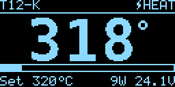 | 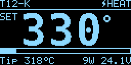 | 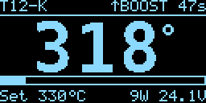 |
| Нагрев / работа | Изменение уставки | Буст |
| 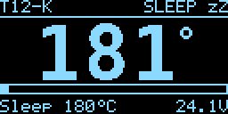 | 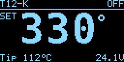 | 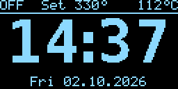 |
| Сон | Выключен (уставка) | Выключен (часы) |
| 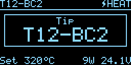 | 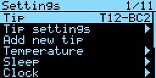 | 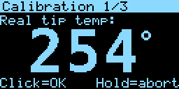 |
| Выбор жала | Меню | Калибровка |

> Скриншоты получены из хост-симулятора интерфейса (`tools/sim`), он компилирует настоящий код UI.

---

## Содержание

1. [Возможности](#возможности)
2. [Компоненты](#компоненты)
3. [Распиновка](#распиновка)
4. [Схема](#схема)
5. [Используемая периферия МК](#используемая-периферия-мк)
6. [Как измеряется температура](#как-измеряется-температура)
7. [Управление](#управление)
8. [Экраны](#экраны)
9. [Меню](#меню)
10. [Калибровка жала](#калибровка-жала)
11. [Сон, датчик вибрации, автовыключение](#сон-датчик-вибрации-автовыключение)
12. [Часы](#часы)
13. [Защиты и ошибки](#защиты-и-ошибки)
14. [Хранение настроек во флеш](#хранение-настроек-во-флеш)
15. [Конфигурация (config.h)](#конфигурация-configh)
16. [Язык интерфейса](#язык-интерфейса)
17. [Сборка и прошивка](#сборка-и-прошивка)
18. [Связь с компьютером (USB / UART)](#связь-с-компьютером-usb--uart)
19. [Протокол](#протокол)
20. [Программа для ПК](#программа-для-пк)
21. [Настройка PID](#настройка-pid)
22. [Структура проекта](#структура-проекта)

---

## Возможности

- Измерение температуры жала T12 (термопара последовательно с нагревателем) **только при выключенном нагревателе**:
  ШИМ и запуск АЦП синхронизированы аппаратно одним таймером, выборка — через настраиваемую паузу после отключения.
- PID-регулятор (коэффициенты свои для каждого жала), ограничение мощности, плавное приближение к уставке.
- До **10 профилей жал**: имя, калибровка по 3 точкам, PID, последняя уставка.
- Калибровка жала по внешнему термометру (250 / 350 / 450 °C).
- Режимы: **выкл / работа / буст / сон / автовыключение**.
- **Датчик вибрации** в ручке (SW-18010P, SW-200D и т.п.) — пробуждение из сна; можно отключить в меню.
- **Часы реального времени** (RTC + кварц 32.768 кГц на плате, батарейка на VBAT). Когда паяльник выключен,
  экран попеременно показывает уставку и часы (время показа настраивается), уставка не теряется:
  любое касание энкодера сразу возвращает экран уставки. Часы отключаются в меню.
- OLED 1.3" 128x64 **SH1106** или 0.96" **SSD1306** (выбор через `#define`), SPI + DMA.
- Энкодер на аппаратном квадратурном декодере таймера, ускорение при быстром вращении.
- Компенсация холодного спая: датчик температуры МК или NTC в ручке.
- Защиты: нет жала, перегрев, «thermal runaway», пониженное напряжение, сторожевой таймер.
- Настройки во внутренней флеш с выравниванием износа и CRC32 (аппаратный блок CRC).
- Пищалка, затемнение экрана в простое.
- **Интерфейс на русском и английском**: язык переключается в меню (`Language` / `Язык`) сразу, без перезагрузки.
- **USB CDC** (виртуальный COM-порт через разъём USB-C платы, без драйверов в Windows 10/11) и **UART**
  (PA9/PA10) с одинаковым текстовым протоколом: настройка всех параметров, профили жал, калибровка,
  поток состояния, часы, перезагрузка, переход в загрузчик USB DFU для обновления прошивки.
- **Программа для ПК** (WPF, .NET 8, Visual Studio 2022): быстрая настройка параметров, выбор и редактирование
  профилей жал, мастер калибровки, импорт / экспорт настроек, автоматические резервные копии,
  синхронизация часов, консоль протокола, светлая и тёмная темы.

---

## Компоненты

| Узел | Рекомендуемые компоненты |
|---|---|
| Плата МК | WeAct Studio BlackPill STM32F401CCU6 (или CEU6), кварцы 25 МГц и 32.768 кГц уже на плате |
| Блок питания | 24 В, ≥ 3 А (T12 ≈ 8 Ом, ≈ 70 Вт при 24 В) |
| Понижающий DC-DC | 24 В → 5 В (MP1584, LM2596, …) для питания BlackPill (вход 5V) |
| Ключ нагревателя | P-MOSFET AO4407A / IRF9540 / SI4435 + NPN BC847 / MMBT3904 / 2N3904 |
| Усилитель термопары | rail-to-rail ОУ с нулевым дрейфом: **OPA333**, TLV333, MCP6V01/MCP6V31, AD8628 (обычные LM358 не подходят — смещение слишком велико) |
| Дисплей | OLED 1.3" SPI 128x64 SH1106, 7 выводов (GND, VDD, SCK, SDA, RES, DC, CS) |
| Энкодер | синий круглый модуль EC11, 20 имп/об, с кнопкой (выводы GND, +, SW, DT, CLK) |
| Датчик вибрации | SW-18010P / SW-200D / SW-520D, в ручке |
| Пищалка | пассивный зуммер (пьезо или электромагнитный через транзистор) |
| Батарейка часов | CR2032 на вывод VB (VBAT) платы |
| Ручка | ручка T12 с разъёмом GX12/GX16 (опционально с NTC и датчиком вибрации) |

---

## Распиновка

| Функция | Вывод | Периферия |
|---|---|---|
| ШИМ нагревателя | **PA8** | TIM1_CH1 (AF1) |
| Термопара (выход ОУ) | **PA1** | ADC1_IN1 |
| NTC ручки (опция) | **PA2** | ADC1_IN2 |
| Делитель VIN | **PA3** | ADC1_IN3 |
| OLED CS | **PA4** | GPIO |
| OLED SCK | **PA5** | SPI1_SCK (AF5) |
| OLED SDA (MOSI) | **PA7** | SPI1_MOSI (AF5) |
| OLED DC | **PB0** | GPIO |
| OLED RES | **PB1** | GPIO |
| Энкодер CLK (A) | **PB6** | TIM4_CH1 (AF2) |
| Энкодер DT (B) | **PB7** | TIM4_CH2 (AF2) |
| Кнопка энкодера SW | **PB8** | GPIO, подтяжка вверх |
| Датчик вибрации | **PB9** | EXTI9, подтяжка вверх |
| Зуммер | **PB4** | TIM3_CH1 (AF2) |
| UART TX | **PA9** | USART1_TX (AF7), 115200 8N1, протокол |
| UART RX | **PA10** | USART1_RX (AF7) |
| USB D− / D+ | PA11 / PA12 | OTG FS (AF10), разъём USB-C платы, USB CDC |
| Светодиод платы | PC13 | индикация работы нагревателя |
| Кварц 32.768 кГц | PC14 / PC15 | LSE для RTC |
| Отладка | PA13 / PA14 | SWD (ST-Link) |

---

## Схема

### Питание

```
 +24V ──┬──────────────────────────────► к истоку P-MOSFET (нагреватель)
        │
        ├── R 100k ──┬──► PA3 (VIN)          делитель 1:11 → 24 В = 2.18 В
        │            ├── R 10k ── GND
        │            └── C 100n ── GND
        │
        └──► DC-DC 24V→5V ──► BlackPill "5V"
                              BlackPill "3V3" ──► OLED VDD, энкодер "+", ОУ
 CR2032 (+) ──► BlackPill "VB"     (-) ──► GND            часы при отключённом питании
```

### Ключ нагревателя (high-side, P-MOSFET)

```
                      +24V ─────────────┬───────────────┐
                                        │               │ S
                                     R1 10k         ┌───┴───┐
                                        │       G   │  Q2   │  AO4407A
                                        ├───────────┤ P-FET │  (опц. стабилитрон 12-15 В G-S)
                                     R2 10k         └───┬───┘
                                        │               │ D
                                        │ C             ├────► T12 конт. 1 (нагреватель+ / термопара+)
 PA8 ── R3 1k ──┬──────────────── B ── Q1 BC847         └────► вход усилителя термопары
                │                       │ E
             R4 10k                    GND              T12 конт. 2 ── GND (общий)
                │                                       T12 конт. 3 ── PE / земля жала
               GND
```

- `PA8 = 1` → Q1 открыт → затвор Q2 притянут вниз (Vgs ≈ −12 В) → **нагреватель включён** (`HEATER_ACTIVE_HIGH 1`).
- **R4 обязателен**: во время сброса/прошивки вывод PA8 висит в воздухе, R4 держит нагреватель выключенным.
- Если используется драйвер с инверсией (нагрев при низком уровне) — `HEATER_ACTIVE_HIGH 0`.

### Усилитель термопары

```
                        R5 10k
 T12 конт. 1 ──┬────────/\/\/\────────┬───────────────► +IN  U1 (OPA333, питание 3V3)
               │                     │
            R6 1M                 D1 BAT54S (ограничитель к GND и к 3V3)
               │                     │
              3V3                 C1 1n
                                     │
                                    GND

 -IN U1 ──┬── R7 470 ── GND
          │
          └── R8 100k ──┐
                        │
 OUT U1 ────────────────┴── R9 1k ──┬──► PA1 (ADC1_IN1)
                                    │
                                 C2 10n
                                    │
                                   GND

 Ку = 1 + R8 / R7 = 1 + 100k / 470 = 213.8
```

- Когда нагреватель включён, на контакте 1 +24 В: R5 ограничивает ток, D1 ограничивает напряжение на входе ОУ,
  выход ОУ уходит в насыщение. Поэтому АЦП запускается только через паузу **ADC delay** после выключения
  нагревателя — за это время ОУ выходит из насыщения и RC-цепочки успокаиваются (τ = 10 мкс).
- **R6 1M** подтягивает линию к 3.3 В: если жало вынуто (цепь термопары разорвана), выход ОУ в насыщении →
  прошивка показывает **NO TIP**. С установленным жалом (≈8 Ом) смещение от R6 ничтожно.
- Коэффициент усиления задаётся `TC_AMP_GAIN` в `config.h` (используется только для калибровки по умолчанию).

### Дисплей, энкодер, датчики

```
 OLED SH1106 (7 pin)        Энкодер (синий модуль)        Датчик вибрации (в ручке)
 GND ── GND                 GND ── GND                    PB9 ──[ SW-18010P ]── GND
 VDD ── 3V3                 +   ── 3V3 (!)                (внутренняя подтяжка)
 SCK ── PA5                 SW  ── PB8
 SDA ── PA7                 DT  ── PB7                    NTC ручки (опция, CJ_SOURCE = CJ_SRC_NTC)
 RES ── PB1                 CLK ── PB6                    3V3 ── 10k ──┬── PA2
 DC  ── PB0                                                            NTC 10k
 CS  ── PA4                 Зуммер (пассивный)                         │
                            PB4 ── 1k ── B  NPN, коллектор ── зуммер ── 5V; эмиттер ── GND
 UART (опция): PA9 ── RX USB-UART (3.3 В), PA10 ── TX USB-UART, GND ── GND
 USB: разъём USB-C самой платы BlackPill (PA11/PA12), отдельная разводка не нужна
```

> Энкодер питайте от **3.3 В**: на модуле стоят подтягивающие резисторы к выводу «+».

---

## Используемая периферия МК

| Блок | Назначение |
|---|---|
| **RCC/PLL** | HSE 25 МГц → PLL → 84 МГц (резерв — HSI, если кварц не запустился) |
| **TIM1** | CH1 — ШИМ нагревателя (период 50–500 мс, разрешение 0.1 мс); CH2 — момент запуска АЦП; при остановке ядра отладчиком выход уходит в «выключено» |
| **ADC1** | 16 преобразований за цикл: 12× термопара, VIN, NTC, датчик температуры МК, VREFINT; запуск от TIM1_CC2 |
| **DMA2 Stream0** | ADC1 → буфер (циклический режим), прерывание по окончанию = цикл регулятора |
| **SPI1 + DMA2 Stream3** | вывод кадра на OLED постранично, CPU свободен |
| **TIM4** | аппаратный квадратурный декодер энкодера с цифровым фильтром |
| **TIM3** | генерация тона пищалки |
| **USART1 + DMA2 Stream7** | протокол: передача из кольцевого буфера по DMA, приём по прерыванию |
| **USB OTG FS** | виртуальный COM-порт (CDC ACM), 48 МГц от PLLQ, драйвер на регистрах |
| **RTC + LSE** | календарь для часов, работает от батарейки VBAT |
| **EXTI9** | датчик вибрации (прерывание по обоим фронтам) |
| **CRC** | контрольная сумма записей настроек |
| **FLASH** | секторы 1–2 (2×16 КБ) — журнал настроек |
| **IWDG** | сторожевой таймер ~2 с, сбрасывается только пока цикл регулятора жив |
| **SysTick** | 1 мс: опрос кнопки, ускорение энкодера, пищалка |
| **FPU** | вычисления PID и пересчёт температуры |

---

## Как измеряется температура

В жале T12 термопара включена последовательно с нагревателем, поэтому измерять её можно только когда ток не течёт.
Один период ШИМ (по умолчанию 100 мс):

```
 CNT:  0                        CCR1                  CCR2      ARR
       |======= нагрев =========|______ пауза _______|^АЦП_____|
                                |<--- ADC delay --->|
                                                     └ TIM1_CC2 запускает ADC1
```

1. TIM1 включает нагреватель в начале периода и выключает его на `CCR1` (скважность от PID).
2. Максимальная скважность ограничена так, что перед `CCR2` всегда есть пауза **ADC delay** (по умолчанию 2.5 мс).
3. На `CCR2` (за 1 мс до конца периода) аппаратно запускается ADC1: 12 выборок термопары + служебные каналы.
4. DMA складывает результаты в буфер, прерывание DMA:
   - усредняет выборки (отбрасывая min/max), фильтрует,
   - переводит код АЦП в температуру по калибровочной таблице жала + температура холодного спая,
   - проверяет аварии, считает PID и записывает новое значение `CCR1` (вступает в силу со следующего периода).

Пересчёт: кусочно-линейная интерполяция по точкам `(смещение ОУ, 0)`, `(ADC₁, ΔT₁)`, `(ADC₂, ΔT₂)`, `(ADC₃, ΔT₃)`,
где ΔT — разница «жало − холодный спай»; за последней точкой — экстраполяция.

---

## Управление

| Действие | Главный экран | Меню |
|---|---|---|
| Вращение | изменить уставку (шаг `Temp step`, с ускорением) | перемещение / изменение значения |
| Нажать и вращать | **выбор жала** (профиля) | — |
| Короткое нажатие | вкл / выкл нагрев; выход из сна; сброс ошибки | войти / редактировать / подтвердить |
| Двойное нажатие | **буст** вкл / выкл | как короткое |
| Долгое нажатие (0.8 с) | **войти в меню** | назад / выход из меню |

Уставка запоминается для каждого жала автоматически (через 4 с после последнего изменения).

---

## Экраны

| Экран | Описание |
|---|---|
|  | **Работа.** Сверху — имя жала и состояние (`HEAT` — нагрев, `READY` — температура достигнута). Крупно — текущая температура. Полоса — мощность. Внизу — уставка, мощность (Вт) и напряжение питания. |
|  | **Изменение уставки.** При вращении энкодера 2 с крупно показывается уставка (`SET`), внизу — текущая температура жала. |
|  | **Буст.** Уставка увеличена на `Boost temp`, справа — оставшееся время. |
|  | **Сон.** Жало поддерживается при `Sleep temp`. |
|  | **Выключен.** Крупно — уставка, внизу — температура жала (мигает `HOT!`, если жало горячее 50 °C). |
|  | **Часы** (только в выключенном состоянии, если включены). Сверху всё равно видна уставка и температура жала. Экран чередуется с экраном уставки: `Setpt time` с уставкой, `Clock time` с часами. |
| 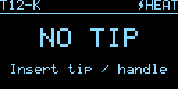 | **Ошибка** (нет жала, перегрев и т.п.). |
|  | **Выбор жала** нажатием с вращением. |
| 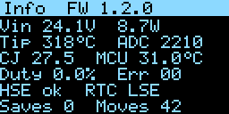 | **Информация** (меню System → Info): напряжение, мощность, код АЦП, холодный спай, температура МК, источники тактирования, счётчик сохранений. |

---

## Меню

Вход — долгое нажатие. В заголовке — название и номер пункта. `▸` — подменю.
Ниже пункты приведены в английском варианте; русские названия — на скриншотах в разделе
[Язык интерфейса](#язык-интерфейса).
Изменение значения: нажать (значение выделяется), вращать, нажать ещё раз. Все изменения применяются сразу,
в флеш записываются при выходе из меню.

 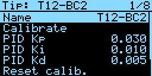 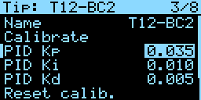

```
Settings
├── Tip ................ активное жало (выбор из списка профилей)
├── Tip settings ▸ ..... настройки активного жала
│   ├── Name ........... имя (8 символов: вращение — символ, нажатие — следующая позиция, долгое — готово)
│   ├── Calibrate ...... калибровка по 3 точкам (см. ниже)
│   ├── PID Kp ......... пропорциональный коэффициент   (0.030, доля мощности на 1 °C)
│   ├── PID Ki ......... интегральный коэффициент       (0.010, 1/(°C·с))
│   ├── PID Kd ......... дифференциальный коэффициент   (0.005, с/°C)
│   ├── Reset calib. ... вернуть калибровку по умолчанию
│   ├── Delete tip ..... удалить профиль (последний удалить нельзя)
│   └── Back
├── Add new tip ........ новый профиль (TIPn) + сразу ввод имени, до 10 профилей
├── Temperature ▸
│   ├── Min temp ....... нижний предел уставки        150 °C (100…480)
│   ├── Max temp ....... верхний предел уставки       450 °C (100…480)
│   ├── Temp step ...... шаг уставки энкодером          5 °C (1…25)
│   ├── Boost temp ..... добавка в режиме буст        +50 °C (10…150)
│   ├── Boost time ..... длительность буста             60 с (10…600)
│   └── Back
├── Sleep ▸
│   ├── Motion sensor .. использовать датчик вибрации    On
│   ├── Sleep after .... переход в сон без движения     5 мин (Off, 1…60)
│   ├── Sleep temp ..... температура во сне           180 °C (100…300)
│   ├── Off after ...... выключение после N мин сна    20 мин (Off, 1…120)
│   ├── Enc. wakes ..... вращение энкодера будит        On (нажатие будит всегда)
│   ├── Power on ....... состояние при включении        Off / Heat
│   └── Back
├── Clock ▸
│   ├── Show clock ..... показывать часы, когда выключен  On
│   ├── Format ......... 24h / 12h
│   ├── Clock time ..... сколько секунд показывать часы    5 с (1…60)
│   ├── Setpt time ..... сколько секунд показывать уставку 5 с (1…60)
│   ├── Set time ▸ ..... Hours, Minutes, Day, Month, Year, Save, Cancel
│   └── Back
├── Display ▸
│   ├── Contrast ....... яркость                         70 % (1…100)
│   ├── Flip 180° ...... поворот изображения             Off
│   ├── Dim idle ....... затемнение через 60 с простоя в выкл/сне  On
│   └── Back
├── Sound .............. звук (клики, сигналы)           On
├── Language ........... язык интерфейса                 English / Русский
├── System ▸
│   ├── PWM period ..... период ШИМ / цикла регулятора  100 мс (50…500)
│   ├── ADC delay ...... пауза «нагрев выкл → АЦП»       2.5 мс (0.5…20)
│   ├── Power limit .... ограничение мощности           Off (5…150 Вт)
│   ├── Heater R ....... сопротивление нагревателя      8.0 Ом (2…20) — для расчёта мощности
│   ├── Low voltage .... порог пониженного питания      Off (0.1…30 В)
│   ├── TC offset ...... смещение нуля усилителя (коды АЦП)   0 (−500…500)
│   ├── Encoder ........ направление вращения           Normal / Reverse
│   ├── Info ........... экран диагностики
│   ├── Factory reset .. сброс всех настроек
│   └── Back
└── Exit ............... выход с сохранением
```

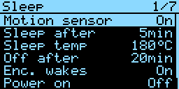 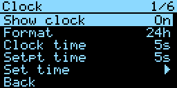 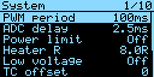

---

## Калибровка жала

Нужен термометр для жал (Hakko FG-100 или аналог). Калибровка относится к **активному** жалу.

1. Меню → *Tip settings* → *Calibrate*.
2. Станция греет жало до **250 °C** (по текущей калибровке) и ждёт стабилизации 5 с
   (можно не ждать — нажать кнопку).
3. Измерьте температуру термометром, вращением энкодера установите **реальное** значение, нажмите кнопку.
4. То же для **350 °C** и **450 °C**.
5. Таблица проверяется на монотонность, сохраняется в профиль жала, на экране `DONE`.
   Долгое нажатие на любом шаге — отмена (калибровка не меняется).

| | |
|:-:|:-:|
| 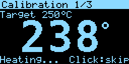 |  |

Если усилитель имеет заметное смещение нуля, его можно скомпенсировать пунктом *System → TC offset*
(код АЦП на холодном жале смотрите в *Info*), а затем откалибровать жало.

---

## Сон, датчик вибрации, автовыключение

- В режиме работы/буста таймер **Sleep after** отсчитывает время с последнего движения ручки
  (датчик вибрации) или действия с энкодером. По истечении — режим **сна** (`Sleep temp`).
- Из сна выводит движение ручки, нажатие кнопки или вращение энкодера (если включено *Enc. wakes*).
- Если в режиме сна прошло **Off after** минут — нагрев выключается (`AUTO OFF`), включить снова — кнопкой.
- Без датчика вибрации (*Motion sensor = Off*) сон наступает только по бездействию энкодера —
  в этом случае обычно выставляют *Sleep after = Off* или большое время.
- Датчик подключается между PB9 и GND; любое изменение состояния = движение (антидребезг 20 мс).

---

## Часы

- Используется встроенный RTC STM32 от кварца 32.768 кГц (есть на BlackPill). Если кварц не запустился,
  RTC работает от LSI (неточно) — это видно в *Info* (`RTC LSI`).
- Время сохраняется при сбросе МК, а с батарейкой CR2032 на выводе **VB** — и при отключении питания.
- Часы показываются **только в выключенном состоянии** и **чередуются** с экраном уставки:
  `Setpt time` секунд уставка → `Clock time` секунд часы → … Любое действие с энкодером сразу показывает уставку.
  В верхней строке экрана часов всегда видны уставка и температура жала.
- Установка: *Clock → Set time*, затем *Save*. Формат 24/12 ч.

---

## Защиты и ошибки

| Сообщение | Причина | Поведение |
|---|---|---|
| `NO TIP` | нет жала / ручки, обрыв нагревателя или термопары | нагрев запрещён, после установки жала работа продолжается автоматически |
| `OVERHEAT` | температура выше 520 °C (`TEMP_OVERHEAT`) | нагрев выключен, сброс — нажатием |
| `RUNAWAY` | 20 с почти полной мощности без роста температуры на 10 °C | нагрев выключен, сброс — нажатием; проверьте ключ, нагреватель, усилитель |
| `LOW VOLT` | напряжение ниже *Low voltage* | нагрев запрещён до восстановления (гистерезис 0.5 В) |
| сброс МК | цикл регулятора (ADC/DMA) остановился | IWDG перезапускает МК, R4 держит нагреватель выключенным |

Дополнительно: на время записи во флеш нагреватель принудительно выключается; при остановке ядра
отладчиком выход TIM1 переводится в неактивное состояние.

---

## Хранение настроек во флеш

- Используются **секторы 1 и 2** (0x08004000–0x0800BFFF, 2×16 КБ). Они исключены из области кода в файлах
  линкера (`EWARM/stm32f401xc_flash.icf`, `gcc/stm32f401xc.ld`), код размещается в секторе 0 и с сектора 3.
- Каждое сохранение дописывает новую запись (~376 байт) с порядковым номером и CRC32 (аппаратный блок CRC).
  В секторе помещается 43 записи; когда он заполнен — стирается другой сектор и запись идёт туда.
  При старте берётся валидная запись с максимальным номером. Сбой питания во время записи не портит настройки.
- Запись происходит при выходе из меню, после калибровки и через 4 с после изменения уставки или жала,
  и только если данные действительно изменились.

> Прошивайте **HEX/OUT** файлом (IAR/ST-Link стирают только нужные секторы). BIN-файл перекрывает
> секторы настроек — после такой прошивки загрузятся значения по умолчанию.

---

## Конфигурация (config.h)

Все аппаратные параметры собраны в [`Core/Inc/config.h`](Core/Inc/config.h):

| Параметр | По умолчанию | Описание |
|---|---|---|
| `OLED_CONTROLLER` | `OLED_SH1106` | `OLED_SH1106` (1.3", смещение столбцов 2) или `OLED_SSD1306` (0.96") |
| `OLED_SPI_BR` | /32 (SH1106), /16 (SSD1306) | делитель SPI1 (SH1106 по даташиту до 4 МГц) |
| `BOARD_HSE_HZ` | 25 МГц | кварц платы |
| `HEATER_ACTIVE_HIGH` | 1 | полярность управления ключом |
| `TC_AMP_GAIN`, `TC_UV_PER_DEG` | 213.8, 21 мкВ/°C | для калибровки по умолчанию |
| `TC_ADC_NO_TIP` | 4000 | порог «нет жала» |
| `TC_SAMPLES` | 12 | выборок термопары за цикл |
| `VIN_DIVIDER` | 11 | коэффициент делителя VIN |
| `CJ_SOURCE` | `CJ_SRC_CHIP` | холодный спай: `CJ_SRC_NONE` (25 °C), `CJ_SRC_CHIP` (датчик МК), `CJ_SRC_NTC` (NTC на PA2) |
| `ENC_COUNTS_PER_DETENT` | 4 | 4 — EC11 20 щелчков/20 имп, 2 — «полушаговые» энкодеры |
| `USE_BUZZER`, `USE_WATCHDOG` | 1 | опции |
| `USE_USB`, `USE_UART`, `UART_BAUD` | 1, 1, 115200 | каналы связи с ПК |
| `UART_STREAM_DEFAULT_MS` | 0 | поток состояния в UART сразу после включения (мс, 0 = выкл) |
| `TEMP_ABS_MIN/MAX`, `TEMP_OVERHEAT` | 100 / 480 / 520 °C | пределы |
| `TIP_MAX`, `TIP_NAME_LEN` | 10, 8 | профили жал |
| `DEFAULT_LANGUAGE` | 1 | язык после первого запуска / сброса настроек: 0 — English, 1 — русский |

---

## Язык интерфейса

Меню **Settings → Language** (в русском интерфейсе **Настройки → Язык**): нажать, вращением выбрать
`English` / `Русский`, нажать ещё раз. Экран переключается сразу, выбор сохраняется во флеш вместе
с остальными настройками. Язык можно сменить и с ПК (параметр `lang` протокола, программа для ПК —
группа «Дисплей»).

| | |
|---|---|
| 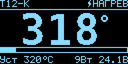 | 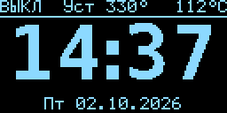 |
| 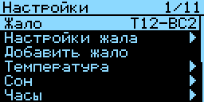 | 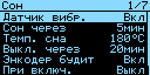 |
| 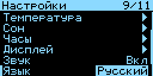 | 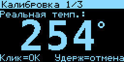 |

Как устроено:

- Все тексты интерфейса собраны в одной таблице в [`tools/gen_lang.py`](tools/gen_lang.py) (идентификатор,
  английский, русский). Скрипт генерирует `Core/Inc/lang.h` (перечисление `S_...`) и `Core/Src/lang.c`
  (таблицы строк); в коде строка берётся функцией `tr(S_...)`.
- Сгенерированные файлы — чистый ASCII: русские буквы записаны кодами Windows-1251 (`"\xC6\xE0..."`),
  поэтому кодировка исходников в IAR/GCC не важна. `Ё/ё` выводятся как `Е/е`.
- Кириллица шрифта 5x7 — в `Core/Src/fonts_cyr.c` (генерирует [`tools/gen_font_cyr.py`](tools/gen_font_cyr.py)
  из рисунков символов), подключена к основному шрифту цепочкой (`font_small.next`).
- Чтобы поправить перевод: изменить таблицу и запустить `python3 tools/gen_lang.py`. Скрипт проверяет,
  что форматы `printf` (`%d`, `%s`…) в обоих языках совпадают, а обычная строка не длиннее 21 символа
  (ширина экрана). Итоговую раскладку удобно проверить симулятором (`tools/sim/sim <папка> 1`).

---

## Сборка и прошивка

### IAR EWARM (основной вариант)

1. Откройте `EWARM/SolderStation.eww` в **EWARM 9.70** или новее (формат проекта 4).
2. Конфигурация **Debug** (оптимизация low) или **Release** (high, size).
3. `Project → Make` (F7), прошивка и отладка — `Download and Debug` (Ctrl+D).
   Отладчик по умолчанию — **J-Link** (SWD). Для ST-Link: `Options → Debugger → Setup → Driver: ST-LINK`.
4. Результат: `EWARM/<cfg>/Exe/SolderStation.out` и `SolderStation.hex`.

Файлы проекта генерирует скрипт `tools/gen_iar.py` из шаблонов `tools/iar_template/`, сохранённых
EWARM 9.70: из шаблона берутся все опции, подставляются только define, пути include, уровень оптимизации
и список файлов. После добавления/удаления исходников запустите `python3 tools/gen_iar.py`.
Если у вас другая версия EWARM — сохраните в ней любой проект для STM32F401CC, положите его
`.ewp/.ewd/.ewt/.eww` в `tools/iar_template/` (как `template.*`) и перезапустите скрипт.
Проверить или выставить опции вручную можно по таблице:

| Раздел Options | Значение |
|---|---|
| General Options → Target → Device | **ST STM32F401CC** (FPU VFPv4 single precision) |
| General Options → Library Configuration | Normal DLIB, printf: Small/Auto |
| C/C++ Compiler → Preprocessor → Defined symbols | `STM32F401xC`, `HSE_VALUE=25000000` |
| C/C++ Compiler → Preprocessor → Include directories | `$PROJ_DIR$\..\Core\Inc`, `$PROJ_DIR$\..\Drivers\CMSIS\Include`, `$PROJ_DIR$\..\Drivers\CMSIS\Device\ST\STM32F4xx\Include` |
| Linker → Config → Linker configuration file | `$PROJ_DIR$\stm32f401xc_flash.icf` |
| Output Converter | Intel extended HEX |
| Debugger → Setup → Driver | J-Link или ST-LINK; Download → Use flash loader(s) |
| Файлы | все `Core/Src/*.c` + `EWARM/startup_stm32f401xc.s` |

Для **STM32F401CE**: Device = STM32F401CE, символ `STM32F401xE`, в ICF конец ROM `0x0807FFFF`, RAM `0x20017FFF`.

### GCC (дополнительно, для CI/проверки)

```bash
sudo apt install gcc-arm-none-eabi libnewlib-arm-none-eabi
make            # build/SolderStation.elf / .hex / .bin
st-flash --format ihex write build/SolderStation.hex
```

### Перегенерация шрифтов и симулятор UI

```bash
pip install pillow
python3 tools/gen_fonts.py          # Core/Src/fonts_digits.c из DejaVu Sans Mono Bold
python3 tools/gen_font_cyr.py       # Core/Src/fonts_cyr.c - кириллица 5x7
python3 tools/gen_lang.py           # Core/Inc/lang.h, Core/Src/lang.c - тексты интерфейса
make -C tools/sim && ./tools/sim/sim /tmp/shots 0 # скриншоты экранов в .pbm (0 - English, 1 - русский)
./tools/sim/proto_test                            # прогон команд протокола через proto.c
```

---

## Связь с компьютером (USB / UART)

Станция доступна с ПК двумя путями, протокол на обоих одинаковый и работает одновременно:

| Канал | Подключение | Скорость |
|---|---|---|
| **USB CDC** | кабель USB-C → разъём платы BlackPill | любая (виртуальный порт) |
| **UART** | USB-UART адаптер 3.3 В к PA9 (TX) / PA10 (RX) | 115200 8N1 (`UART_BAUD`) |

- USB-устройство: VID `0483`, PID `5740` (виртуальный COM-порт ST), имя «T12 Soldering Station»,
  серийный номер — уникальный ID микроконтроллера. Windows 10/11, Linux и macOS используют встроенный
  драйвер CDC ACM; для Windows 7 нужен драйвер ST VCP.
- Драйвер USB написан на регистрах OTG FS (без HAL/USB Middleware). VBUS не контролируется
  (PA9 занят UART), поэтому станция всегда «подключена» к шине, когда кабель вставлен.
- Плата питается от DC-DC станции. На WeAct BlackPill v3.x линия VBUS развязана диодом, одновременное
  подключение USB и питания станции допустимо (проверьте свою ревизию платы).

### Обновление прошивки по USB (DFU)

Команда `DFU` (или кнопка в программе) перезапускает МК в системный загрузчик STM32. Дальше прошивка
записывается программой **STM32CubeProgrammer** (порт USB, режим DFU) — без ST-Link. Записывайте `.hex`:
так секторы настроек сохраняются. Выход из загрузчика — отключить и снова подать питание.
Тот же загрузчик также доступен на UART1 (PA9/PA10).

---

## Протокол

Текстовый, построчный (`\n` или `\r\n`), команды без учёта регистра. Удобно проверять в любом терминале.

```
запрос:  КОМАНДА [аргументы]
ответ:   = данные            (ноль или больше строк)
         OK | ERR <код> <текст>
события: !S key=value ...    поток состояния (после STREAM <мс>)
         !C                  настройки изменены на самой станции (меню, энкодер)
```

Коды ошибок: `1` — неизвестная команда, `2` — неверный аргумент, `3` — вне диапазона,
`4` — недопустимо сейчас (например, удалить последнее жало), `5` — ошибка записи флеш.

| Команда | Ответ / действие |
|---|---|
| `PING` | `= T12STATION fw=1.2.0` — проверка связи |
| `HELP` | список команд |
| `INFO` | `= fw=… oled=SH1106 tipmax=10 namelen=8 uid=… hse=1 lse=1 saves=…` |
| `STATUS` | одна строка состояния (формат как у `!S`) |
| `STREAM <мс>` | поток `!S` с интервалом 50…5000 мс (не чаще цикла регулятора), `0` — выключить |
| `PARAMS` | `= <ключ> <мин> <макс> <значение>` для всех параметров |
| `GET [ключ]` | значение параметра или всех параметров |
| `SET <ключ> <значение>` | применить параметр (сохраняется во флеш автоматически через 4 с) |
| `SAVE` | записать настройки во флеш немедленно |
| `DEFAULTS` | заводские значения (сохранятся через 4 с или по `SAVE`) |
| `MODE OFF\|RUN\|BOOST\|SLEEP` | режим работы (без аргумента — текущий режим) |
| `TEMP <°C>` | уставка активного жала |
| `CLEAR` | сбросить защёлкнутые ошибки (перегрев, runaway) |
| `BEEP` | три звуковых сигнала — найти станцию |
| `TIPS` | `= ACTIVE <акт> <кол-во> <макс>` и строки `= TIP <i> <уставка> <kp> <ki> <kd> <adc1> <adc2> <adc3> <dt1> <dt2> <dt3> <имя>` |
| `TIP SEL <i>` | сделать жало активным |
| `TIP ADD [имя]` | добавить профиль, ответ `= <индекс>` |
| `TIP DEL <i>` | удалить профиль |
| `TIP NAME <i> <имя>` | переименовать (до 8 символов `A-Z 0-9 - _ . + / #`, пробелы допустимы) |
| `TIP SET <i> <поле> <знач>` | поле: `set`, `kp`, `ki`, `kd` (×1000), `adc1..3`, `dt1..3` |
| `TIP CALRESET <i>` | калибровка по умолчанию |
| `CAL START` | запустить мастер калибровки активного жала (на экране станции тоже) |
| `CAL` | `= active=1 step=0 target=250 tip=248.3 stable=1 done=0 ok=0` |
| `CAL POINT <°C>` | записать текущую точку с температурой по термометру |
| `CAL ABORT` | прервать калибровку |
| `TIME [ГГГГ-ММ-ДД ЧЧ:ММ:СС]` | прочитать / установить часы |
| `RESET` | перезагрузка |
| `DFU` | перезагрузка в системный загрузчик (USB DFU) |

Строка состояния (`STATUS`, `!S`):

```
mode=RUN auto=0 set=320 tgt=320 tip=318.2 raw=2210 duty=12.0 pwr=8.7 vin=24.1 cj=27.5 mcu=31.0 err=0 tipn=0 boost=0 stable=1 cal=0
```

`mode` — OFF/RUN/BOOST/SLEEP/CAL; `auto` — выключен по таймеру; `set` — уставка; `tgt` — текущая цель
(с учётом сна/буста); `tip` — температура, °C; `raw` — код АЦП; `duty` — скважность, %; `pwr` — мощность, Вт;
`vin` — питание, В; `cj` — холодный спай; `mcu` — температура МК; `err` — биты ошибок
(1 — нет жала, 2 — перегрев, 4 — runaway, 8 — низкое напряжение); `tipn` — активное жало;
`boost` — секунд буста осталось; `stable` — температура в пределах ±3 °C; `cal` — идёт калибровка.

Ключи параметров (`GET`/`SET`, значения в «сырых» единицах):

| Ключ | Диапазон | Единицы | Пункт меню |
|---|---|---|---|
| `temp_min`, `temp_max` | 100…480 | °C | Temperature → Min/Max temp |
| `temp_step` | 1…25 | °C | Temp step |
| `boost_add`, `boost_time` | 10…150, 10…600 | °C, с | Boost temp / time |
| `sleep_temp` | 100…300 | °C | Sleep temp |
| `sleep_time`, `off_time` | 0…60, 0…120 | мин (0 = выкл) | Sleep after / Off after |
| `motion_en`, `wake_on_enc` | 0/1 | | Motion sensor / Enc. wakes |
| `start_mode` | 0/1 | выкл/нагрев | Power on |
| `clock_en`, `clock_24h` | 0/1 | | Show clock / Format |
| `clock_show`, `set_show` | 1…60 | с | Clock time / Setpt time |
| `contrast` | 1…100 | % | Contrast |
| `flip`, `dim_idle`, `buzzer`, `enc_invert` | 0/1 | | Flip / Dim idle / Sound / Encoder |
| `pwm_period` | 50…500 | мс | PWM period |
| `adc_delay` | 5…200 | 0.1 мс | ADC delay |
| `power_limit` | 0…150 | Вт (0 = нет) | Power limit |
| `heater_res` | 20…200 | 0.1 Ом | Heater R |
| `low_volt` | 0…300 | 0.1 В (0 = выкл) | Low voltage |
| `adc_offset` | −500…500 | ед. АЦП | TC offset |
| `lang` | 0/1 | 0 — English, 1 — русский | Language |

Пример сессии:

```
> SET temp_max 470
OK
> TIP ADD D24
= 3
OK
> TIP SET 3 kp 45
OK
> STREAM 200
OK
!S mode=RUN auto=0 set=350 tgt=350 tip=349.6 raw=2394 duty=11.4 pwr=8.3 vin=24.1 cj=27.5 ...
```

Протокол можно проверить без железа: `make -C tools/sim && tools/sim/proto_test` прогоняет набор
команд через настоящий `proto.c`.

---

## Программа для ПК

Папка [`PC/`](PC) — решение Visual Studio 2022 (`PC/SolderStation.sln`), WPF, **.NET 8**, MVVM
(CommunityToolkit.Mvvm), `System.IO.Ports`. Сборка: открыть решение и нажать F5, либо
`dotnet build PC/SolderStation.sln -c Release`. Исполняемый файл — `T12Station.exe`.

Возможности:

- **Подключение**: список COM-портов с названиями устройств, станция по USB определяется автоматически
  (VID/PID) и подключается при запуске; поиск станции перебором портов (`PING`); автоматическое
  переподключение при обрыве (выдернули кабель); скорость для UART.
- **Живая панель**: крупная температура жала, режим, цель, мощность, скважность, питание, холодный спай,
  температура МК, ошибки с кнопкой сброса. Графика нет — только быстрые цифры.
- **Режимы**: Выкл / Нагрев / Буст / Сон одной кнопкой.
- **Быстрая уставка**: ползунок, ±1/±10, набор пресетов (добавляются кнопкой «Запомнить», удаляются
  правым кликом). Изменение энкодером на станции сразу видно в программе.
- **Выбор активного жала** из выпадающего списка.
- **Настройки**: все параметры станции по группам (ползунок + поле ввода, переключатели, списки),
  применяются сразу при изменении (с задержкой 0.3 с), станция сама сохраняет их во флеш через 4 с;
  «Сохранить во флеш» — немедленно. Изменения, сделанные в меню станции, подхватываются автоматически
  (событие `!C`).
- **Жала**: список профилей, редактор имени, уставки, PID и таблицы калибровки, добавление / удаление,
  сброс калибровки, **мастер калибровки** (станция греет до 250/350/450 °C, вы вводите показания
  термометра в программе).
- **Импорт / экспорт** всех настроек и профилей жал в JSON (перенос на другую станцию, бэкап);
  при импорте значения проверяются по диапазонам прошивки.
- **Резервная копия при каждом подключении** в `%AppData%\T12Station\backups` (20 последних на станцию),
  восстановление из копии в один клик.
- **Сервис**: синхронизация часов станции с ПК, звуковой сигнал «найти станцию», перезагрузка,
  переход в режим обновления прошивки (DFU).
- **Консоль** протокола с журналом обмена (поток `!S` можно скрыть).
- **Две темы** — светлая и тёмная, переключаются на лету; выбор, порт и размер окна запоминаются.
- **Язык интерфейса** — русский или английский (выпадающий список в заголовке окна), переключается
  на лету; при первом запуске выбирается по языку Windows. Строки лежат в `Lang/ru.xaml` и
  `Lang/en.xaml` — для нового языка достаточно добавить ещё один такой словарь и строку в `Loc.Languages`.

Структура проекта:

```
PC/SolderStation.App
├── Models/         StationStatus, TipData, ParamCatalog (русские названия и группы), SettingsFile (JSON)
├── Services/       StationClient (порт + протокол), PortScanner (WMI), SettingsTransfer (импорт/экспорт/бэкап),
│                   ThemeManager, Loc (язык), AppSettingsStore, Dialogs
├── ViewModels/     MainViewModel (+ .Live, .Params, .Tips, .Service), ParamViewModel, TipViewModel,
│                   CalibrationViewModel
├── Views/          MainWindow, CalibrationWindow
├── Themes/         Light.xaml, Dark.xaml (цвета), Styles.xaml (стили контролов)
├── Lang/           ru.xaml, en.xaml — строки интерфейса (Services/Loc.cs переключает язык)
└── Behaviors/, Converters/, Assets/
```

---

## Настройка PID

Включите поток состояния (`STREAM 100` в консоли программы или любом терминале) — каждая строка `!S`
содержит температуру, цель, скважность и мощность. Удобно строить графики (SerialPlot и т.п.).
Чтобы поток шёл в UART сразу после включения, задайте `UART_STREAM_DEFAULT_MS` в `config.h`.

Рекомендации:
- Ниже `уставка − 30 °C` регулятор всегда даёт полную мощность (быстрый разогрев), PID работает в окне ±30 °C.
- Перерегулирование — уменьшить **Kp** или увеличить **Kd**; медленно доходит до уставки — увеличить **Ki**.
- Шумная температура — увеличить *ADC delay* (ОУ не успевает восстановиться) или проверить RC-цепи.

---

## Структура проекта

```
├── Core
│   ├── Inc/            заголовки (config.h — настройки сборки, board.h — распиновка)
│   └── Src/
│       ├── main.c          инициализация и главный цикл
│       ├── sys.c           тактирование 84 МГц, SysTick, IWDG, CRC
│       ├── heater.c        TIM1 (ШИМ + запуск АЦП), ADC1, DMA2 Stream0
│       ├── iron.c          регулятор: пересчёт температуры, PID, режимы, защиты
│       ├── oled.c          SH1106/SSD1306 по SPI1 + DMA2 Stream3
│       ├── gfx.c           графика, текст
│       ├── fonts_small.c   шрифт 5x7
│       ├── fonts_cyr.c     кириллица 5x7 (генерируется)
│       ├── fonts_digits.c  крупные цифры (генерируется)
│       ├── lang.c          тексты интерфейса EN/RU (генерируется tools/gen_lang.py)
│       ├── input.c         энкодер TIM4, кнопка
│       ├── ui.c            экраны, калибровка
│       ├── menu.c          движок меню и дерево пунктов
│       ├── settings.c      настройки и профили, журнал во флеш
│       ├── flash.c         стирание/запись флеш
│       ├── rtc.c           часы реального времени
│       ├── motion.c        датчик вибрации (EXTI)
│       ├── buzzer.c        пищалка (TIM3)
│       ├── uart.c          USART1: передача по DMA, приём по прерыванию
│       ├── usb_cdc.c       USB CDC (OTG FS) на регистрах
│       ├── proto.c         текстовый протокол для ПК (USB и UART), переход в DFU
│       └── system_stm32f4xx.c   CMSIS (ST)
├── Drivers/CMSIS       заголовки CMSIS Core 5.x и STM32F4xx (Apache 2.0)
├── EWARM               проект IAR, startup, ICF
├── gcc                 startup и скрипт линкера для GCC
├── PC                  программа для ПК (WPF, .NET 8, Visual Studio 2022)
├── tools               генераторы шрифтов и проекта IAR, симулятор UI и тест протокола
└── docs/img            скриншоты
```

## Лицензии сторонних файлов

- CMSIS Core, CMSIS Device STM32F4xx — Apache License 2.0 (ARM, STMicroelectronics).
- Крупные цифры получены из шрифта DejaVu Sans Mono Bold (Bitstream Vera license).
